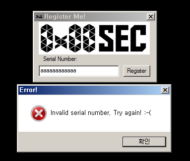

# **Gone Fishing**

#### tag : reversing

-----------------------------------------------

#### Description

>Gone Fishing! Find the fish!.. I mean flag.

-----------------------------------------------

#### Solution

This program is windows 32 bit program. So, I debug this program by ollydbg.

~~~

$ file challenge-001.exe
challenge-001.exe: PE32 executable (GUI) Intel 80386, for MS Windows

~~~

When, I put wrong serial number to program. I follow this message box.

And, Just following this code, I can find serial number in heap area.

Yeah, Serial number is 0G932SE1L48Y6G.

**0x00CTF{F1SH1N9_R3QU1R3S_G00D_B4IT}**
