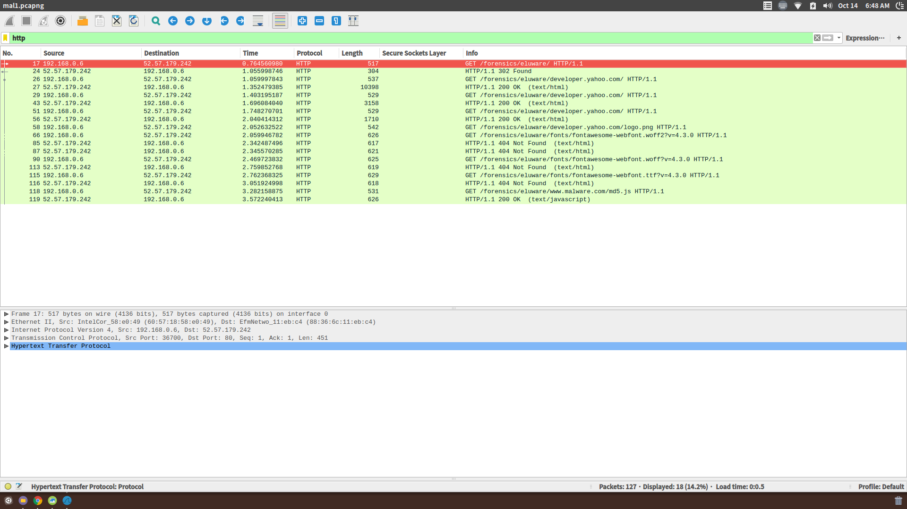
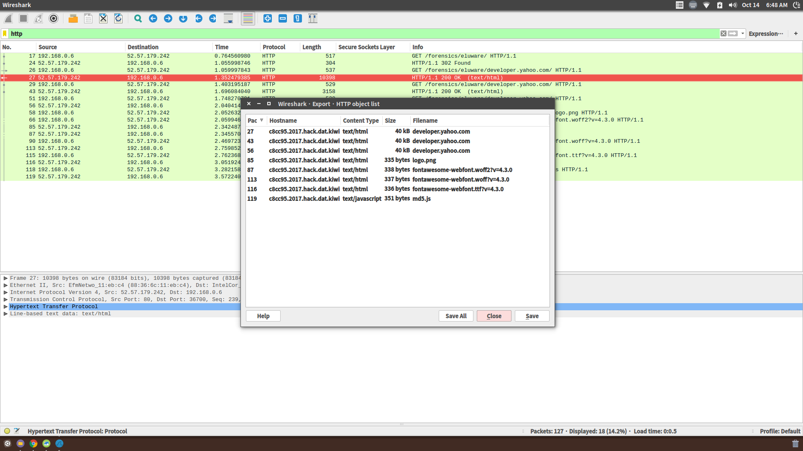

# **Eluware 1(150)**

#### tag : forensics

-----------------------------------------------------------------

#### Description

>There's nasty malware infecting our visitors. We were unable to find out where it's coming from and what it's doing. Do us a solid and find that out!

-----------------------------------------------------------------

#### Challenge

 This is website of problem link.

 I can get message 'Pwned' from page, when I just waiting some seconds.

 I use wireshark to capture http packets when malware running.

 I extract some http object from wireshark.

~~~
#md5.js

// console.log("You just got pwned!");

function md5_base_(a,b,c)
{
	document.getElementsByClassName("logo-container")[0].innerHTML="Pwned";
	flag();
}
function flag()
{
	return "rqtWBTPbJ8cXgYSX";
}
setTimeout(md5_base_,Math.random()*4000+500);
~~~

 I find md5.js in objects.

-----------------------------------------------------------------

#### Solution

I can get flag in flag().

~~~
function flag()
{
 return "rqtWBTPbJ8cXgYSX";
}
~~~

### **flag rqtWBTPbJ8cXgYSX**
