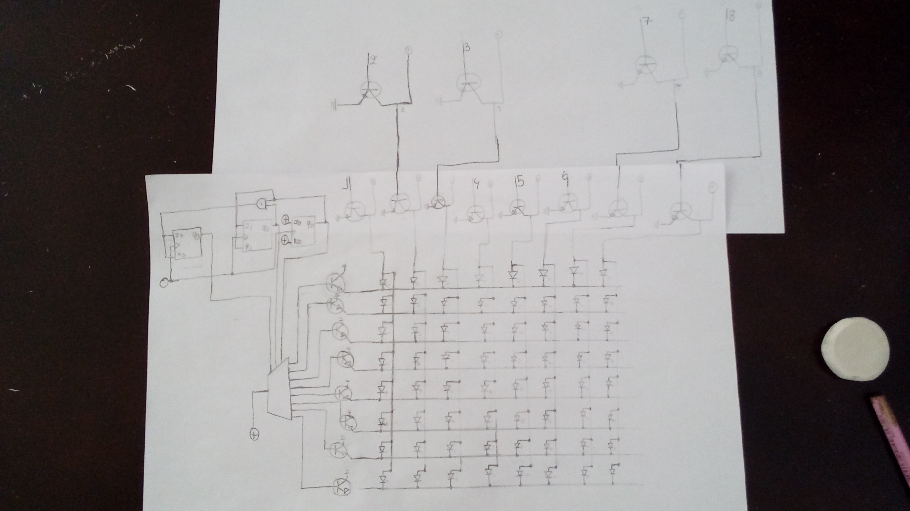

# **Sum (Hello World Platform)**

#### tag : PPC-M

----------------------------------------------------------------------

#### Description

>Molly was able to take pictures of a strange digital circuit sketch, along with an also strange message. All of these things were inside an envelope in a safe, which was labeled "Top Secret".

>We believe it might contain Butcher Corp's plans for the future, can you help us read the message?

----------------------------------------------------------------------

#### Challenge

Well, I can get this image with text file named Message.txt

I don't know about circuit. But I can guess

First, Circuit table is 8*8 in image.

(But there is 16*9 in Message.txt)

Second, 010011100 is repeated every even line.

Finally, I guess 010011100 is key number to get original text table. 

So I try to Message^010011100 to get flag.

----------------------------------------------------------------------

#### Solution

**sovle.py**

~~~

f1 = open('./table.txt','r')
f2 = open('./result.txt','w')

xor = "010011100"

lines = f1.readlines()
for line in lines:
    f2.write(str(bin(int(line,2)^int(xor,2)))[2:]+'\n')

~~~

**CTF-BR{LOCATE_AND_KILL_REMS}**
