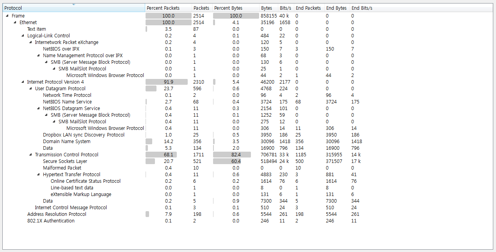
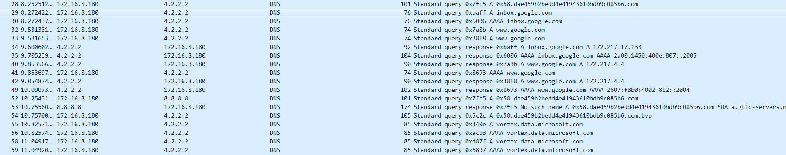
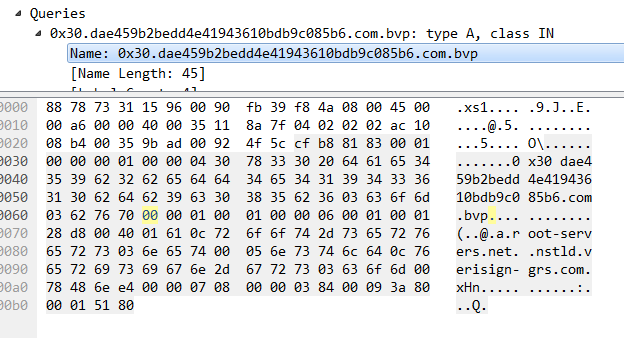

# **Dennis and Co.**

#### tag : forensics

-----------------------------------------------

#### Description

>>https://goo.gl/55prrK

-----------------------------------------------

#### Solution

~~~

$ file DNST.pcapng
DNST.pcapng: pcap-ng capture file - version 1.0

~~~

There are many ineteresting packet types in capture file, but I focus on prob's file name is `DNST`.

Then, I serach the DNS packets to find something special.

Well, I find there is specious queries in DNS packets.

Specious DNS queries is formated - `0xXX.dae459b2bedd4e41943610bdb9c085b6.com`, and I find 0xXX is charater byte encoded by base64.

So I make some code to get flag.

~~~

$ strings DNST.pcapng | grep 0x | grep dae459b2bedd4e41943610bdb9c085b6 > result

~~~

~~~

import base64

res = '*'

with open('result', 'r') as f:
	for line in f.readlines():
		if chr(int(line[2:4],16)) != res[-1]:
			res += chr(int(line[2:4],16))

print base64.b64decode(res[1:])

~~~

~~~

$ python ./solve.py
evlz{dns_tunneling_withoust_ssh}ctf

~~~

**evlz{dns_tunneling_withoust_ssh}ctf**
