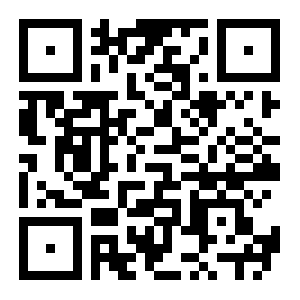

# **Quick Response**

#### tag : forensic

-----------------------------------------------

#### Description

>Tony had created a QR code for a specific purpose, and sent to his friend Rhody for deployment but when deployed, the QR code wasn’t working as it was supposed to. Figure out what’s wrong and help fix the problem.

-----------------------------------------------

#### Solution

This is strange qr code. So I take action to recover qr code.

Changed:

I read qr code by online page:

**pctf{r3p4irlnG~Qr_1s-my_h0bBy}**
