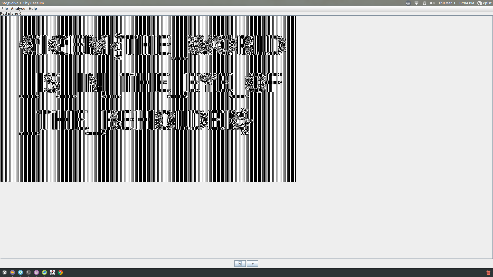

# **Image'n That**

#### tag : crypto

-----------------------------------------------

#### Description

>My buddy claims that the safest way to encrypt his secret images with the secure AES-ECB algorithm. Can you prove him wrong?

-----------------------------------------------

#### Solution

Well, There is encrypted bmp by AES-ECB. But I think I can guess flag of this image. But, I need to make this image clearly.

In this case, I use stegsolve to handle this image.

~~~

$ java -jar ./stegsolve.jar

~~~

I can see flag text clearly in frame `Red plane 6`.

**GIGEM{THE_WORLD_IS_IN_THE_EYE_OF_THE_BEHOLDER}**
