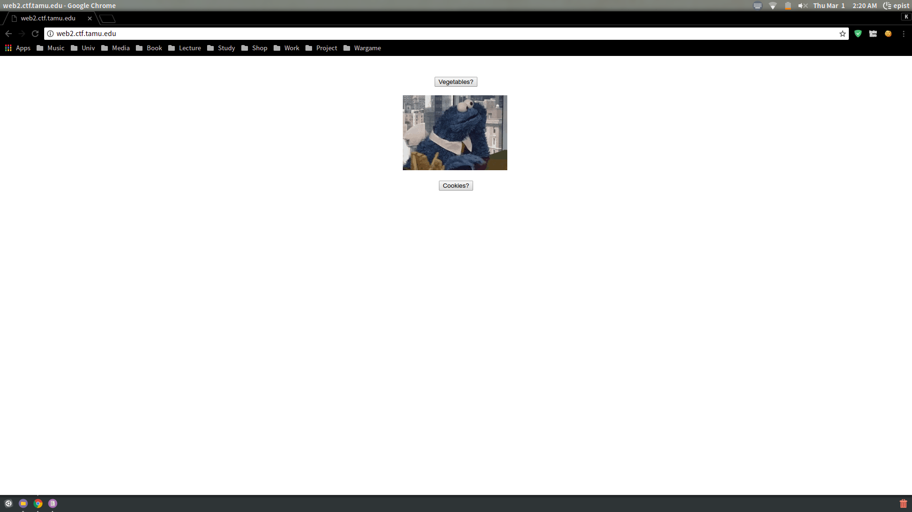
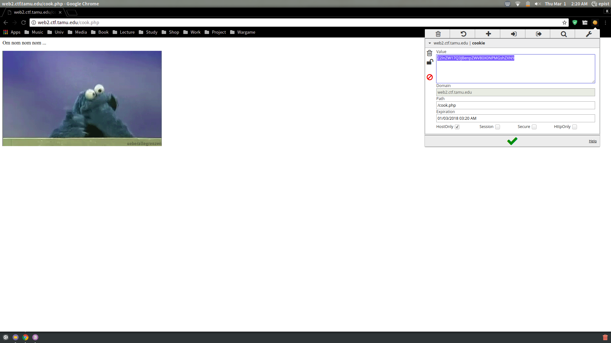

# **Veggies**

#### tag : web

-----------------------------------------------

#### Description

>So many choices...

>http://web2.ctf.tamu.edu

-----------------------------------------------

####

I could get this page follwing link.

Well, I think cookie button is suspicious. And I get some cookie from page.

It's encoded by base64, So I have to decode this.

~~~

>>> import base64
>>> flag = base64.b64decode('Z2lnZW17Q3JBenpZWV80X0NPMGshZXN9')
>>> print flag
gigem{CrAzzYY_4_CO0k!es}

~~~

**gigem{CrAzzYY_4_CO0k!es}**
