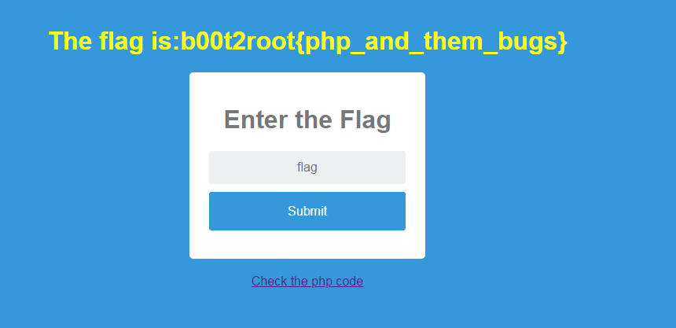

# **Easy PHP**

#### tag : web

-----------------------------------------------

#### Description

>Give the flag and get the flag.
>
>Link here:
>http://18.188.94.231/easy-php/
>
>Author : IceWizard

-----------------------------------------------

#### Solution

Well, Web page is down after competition.. So I can't write detail.

In php source, This page use `strcmp` to verify flag. But `strcmp` have vulnerability in checking string.

If `value[]` is in `strcmp`, It'll check only first byte. I can guess flag format is `b00t2root{...}`.

~~~

flag[]=b

~~~

**b00t2root{php_and_them_bugs}**
